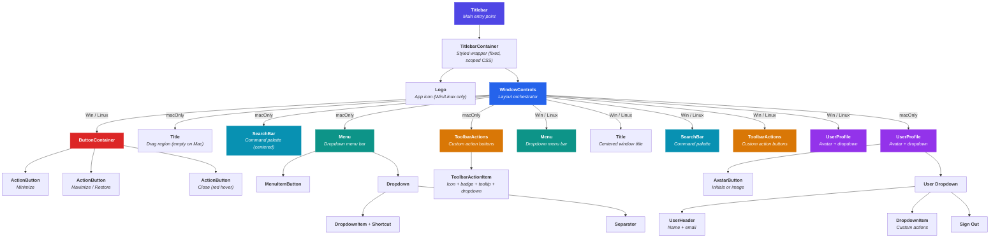
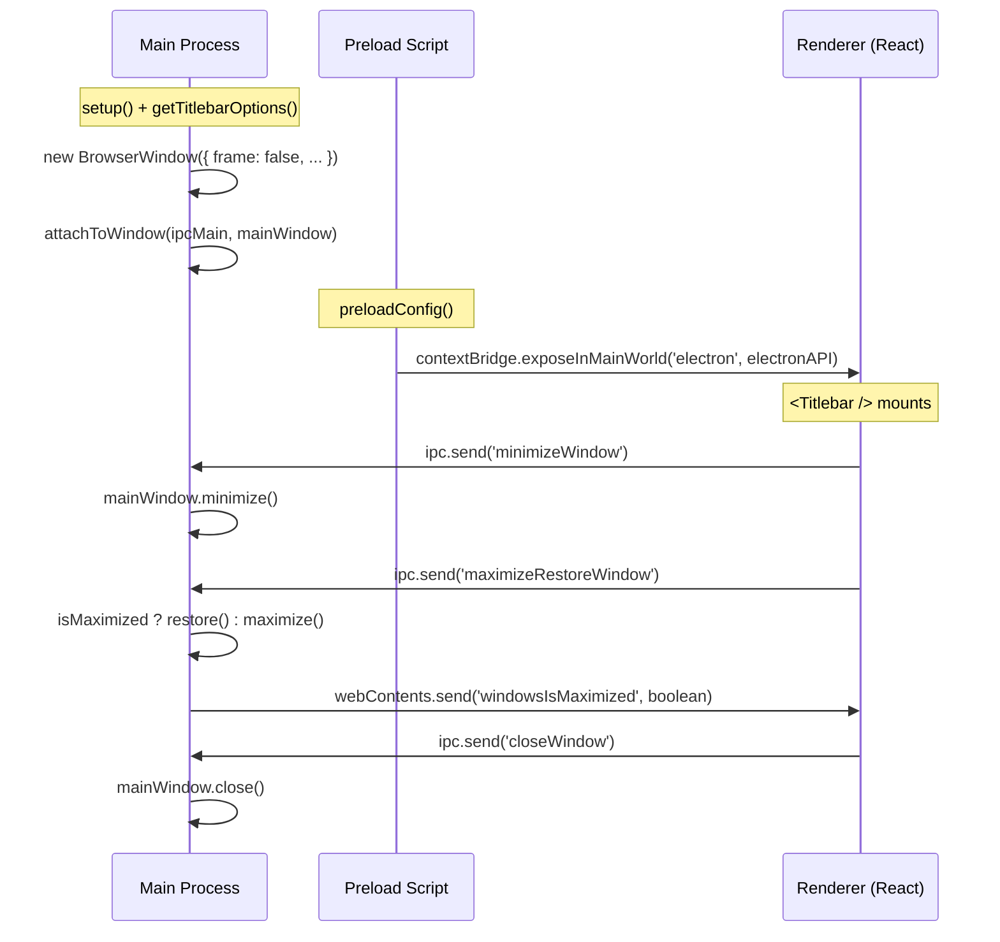
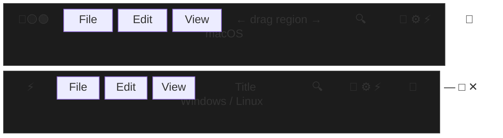
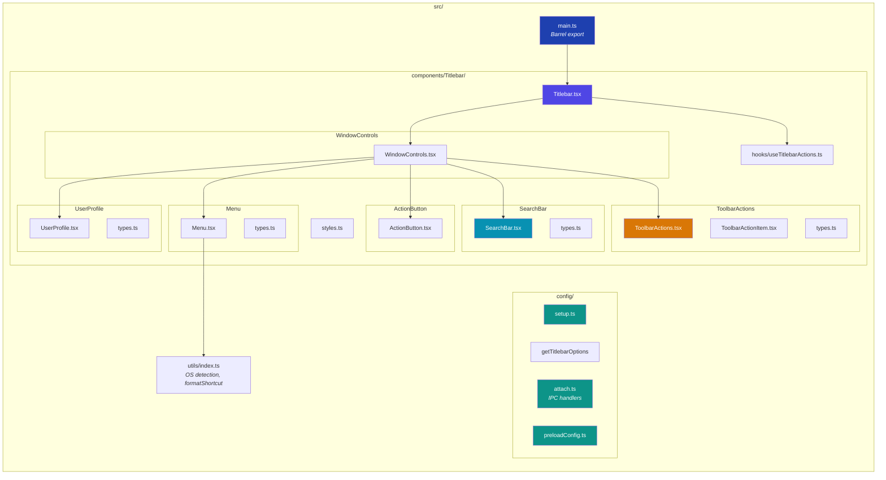

# Pretty Electron Titlebar


[](https://www.npmjs.com/package/@drycstud.io/electron-titlebar)


[](https://github.com/euclidesdry/electron-electron-pretty-titlebar/blob/main/LICENSE)

A pretty, cross-platform titlebar for Electron apps built with React. Automatically adapts to **macOS** (native traffic lights), **Windows**, and **Linux** — similar to VS Code, Figma, and Postman.

## Features

- **Cross-platform** — Native look on macOS (traffic lights), custom window controls on Windows/Linux
- **Menu bar** — Full dropdown menus with submenus, keyboard navigation, separators, and disabled items
- **Toolbar actions** — Customizable action buttons (notifications, settings, upgrade) with badges, tooltips, dropdowns, and highlight effects
- **User profile** — Avatar with status indicator, dropdown actions, sign-in/sign-out flow
- **Command palette** — Searchable command palette with sections, filters, keyboard navigation, and footer actions
- **Keyboard shortcuts** — Define shortcuts once in Windows notation (`Ctrl+S`), automatically formatted as macOS symbols (`⌘S`) on Mac
- **Keyboard navigation** — Full Arrow key, Enter, and Escape support for menus, command palette, and toolbar dropdowns
- **Zero CSS conflicts** — Styles are fully scoped; works alongside Tailwind CSS, CSS Modules, or any other styling solution
- **Super customizable** — Custom title, logo, size, menus, toolbar actions, user profile, command palette, and window action handlers
- **TypeScript** — Full type definitions included
- **100% test coverage** — Comprehensive tests with Vitest
- **Storybook** — Interactive component documentation for all variants

## Table of Contents

- [Pretty Electron Titlebar](#pretty-electron-titlebar)
  - [Features](#features)
  - [Table of Contents](#table-of-contents)
  - [Installation](#installation)
  - [Quick Start](#quick-start)
    - [1. Main Process Setup](#1-main-process-setup)
    - [2. Preload Script Setup](#2-preload-script-setup)
    - [3. Renderer (React) Setup](#3-renderer-react-setup)
  - [Menu System](#menu-system)
    - [Defining Menus](#defining-menus)
    - [Keyboard Shortcuts](#keyboard-shortcuts)
    - [Keyboard Navigation](#keyboard-navigation)
  - [Toolbar Actions](#toolbar-actions)
    - [Defining Actions](#defining-actions)
    - [Custom Render Actions](#custom-render-actions)
  - [User Profile](#user-profile)
  - [Command Palette](#command-palette)
  - [API Reference](#api-reference)
    - [Titlebar Component](#titlebar-component)
      - [Props](#props)
    - [Types](#types)
    - [Config Functions](#config-functions)
      - [`setup()`](#setup)
      - [`getTitlebarOptions()`](#gettitlebaroptions)
      - [`attachToWindow(ipcMain, mainWindow)`](#attachtowindowipcmain-mainwindow)
      - [`preloadConfig()`](#preloadconfig)
    - [Utility Functions](#utility-functions)
      - [`formatShortcut(shortcut, platform)`](#formatshortcutshortcut-platform)
  - [Platform Behavior](#platform-behavior)
    - [macOS](#macos)
    - [Windows](#windows)
    - [Linux](#linux)
    - [Overriding Platform Detection](#overriding-platform-detection)
  - [CSS Framework Compatibility](#css-framework-compatibility)
  - [Custom Window Action Handlers](#custom-window-action-handlers)
  - [Storybook](#storybook)
    - [Available Stories](#available-stories)
    - [Documentation Pages](#documentation-pages)
  - [Examples](#examples)
  - [Peer Dependencies](#peer-dependencies)
  - [License](#license)
- [Architecture](#architecture)
  - [Component Tree](#component-tree)
  - [Electron IPC Flow](#electron-ipc-flow)
  - [Platform Layout Comparison](#platform-layout-comparison)
  - [File Structure](#file-structure)

## Architecture

### Component Tree



### Electron IPC Flow



### Platform Layout Comparison



### File Structure



## Installation

```bash
# npm
npm install @drycstud.io/electron-titlebar

# yarn
yarn add @drycstud.io/electron-titlebar

# pnpm
pnpm add @drycstud.io/electron-titlebar
```

## Quick Start

Integration requires changes in three files: the **main process**, the **preload script**, and the **renderer (React)**.

### 1. Main Process Setup

In your Electron main process file (usually `main.ts` or `main.js`), import `setup`, `getTitlebarOptions`, and `attachToWindow` from the config entry point:

```typescript
// main.ts
import { app, BrowserWindow, ipcMain } from 'electron';
import { setup, getTitlebarOptions, attachToWindow } from '@drycstud.io/electron-titlebar/config';

setup();

function createWindow(): void {
  const mainWindow = new BrowserWindow({
    width: 1280,
    height: 840,
    ...getTitlebarOptions(), // Applies correct frame/titlebar settings per platform
    webPreferences: {
      nodeIntegration: true,
      preload: path.join(__dirname, '../preload/index.js'),
      sandbox: false,
    },
  });

  mainWindow.on('ready-to-show', () => {
    attachToWindow(ipcMain, mainWindow); // Registers IPC handlers for window controls
    mainWindow.show();
  });
}

app.whenReady().then(createWindow);
```

**What `getTitlebarOptions()` returns per platform:**

| Platform        | `frame` | `titleBarStyle` | `trafficLightPosition` |
|-----------------|---------|-----------------|------------------------|
| macOS           | `false` | `'hiddenInset'` | `{ x: 10, y: 10 }`    |
| Windows / Linux | `false` | `'hidden'`      | —                      |

On macOS, `hiddenInset` preserves the native traffic light buttons (close, minimize, maximize) while hiding the rest of the native titlebar. On Windows and Linux, the frame is fully hidden and replaced by custom controls rendered by the `Titlebar` React component.

### 2. Preload Script Setup

In your Electron preload script (usually `preload.ts` or `preload.js`), call `preloadConfig` to expose the required IPC APIs to the renderer:

```typescript
// preload.ts
import { preloadConfig } from '@drycstud.io/electron-titlebar/config';

preloadConfig();
```

This uses `contextBridge.exposeInMainWorld` to safely expose the Electron IPC renderer API to the browser window. It is required for the window control buttons (minimize, maximize, close) to work.

### 3. Renderer (React) Setup

In your React app entry point or root component, render the `Titlebar` component with menus:

```tsx
// App.tsx
import Titlebar from '@drycstud.io/electron-titlebar';
import type { MenuItem } from '@drycstud.io/electron-titlebar';
import appLogo from './assets/logo.svg';

const menuItems: MenuItem[] = [
  {
    label: 'File',
    submenu: [
      { label: 'New File', shortcut: 'Ctrl+N', action: () => console.log('New File') },
      { label: 'Open File...', shortcut: 'Ctrl+O', action: () => console.log('Open') },
      { type: 'separator', label: '' },
      { label: 'Save', shortcut: 'Ctrl+S', action: () => console.log('Save') },
      { label: 'Save As...', shortcut: 'Ctrl+Shift+S', action: () => console.log('Save As') },
      { type: 'separator', label: '' },
      { label: 'Exit', shortcut: 'Alt+F4', action: () => globalThis.close() },
    ],
  },
  {
    label: 'Edit',
    submenu: [
      { label: 'Undo', shortcut: 'Ctrl+Z', action: () => console.log('Undo') },
      { label: 'Redo', shortcut: 'Ctrl+Shift+Z', action: () => console.log('Redo') },
      { type: 'separator', label: '' },
      { label: 'Cut', shortcut: 'Ctrl+X', action: () => console.log('Cut') },
      { label: 'Copy', shortcut: 'Ctrl+C', action: () => console.log('Copy') },
      { label: 'Paste', shortcut: 'Ctrl+V', action: () => console.log('Paste') },
    ],
  },
  {
    label: 'Help',
    submenu: [
      { label: 'Documentation', action: () => console.log('Docs') },
      { label: 'About', action: () => console.log('About') },
    ],
  },
];

export default function App() {
  return (
    <>
      <Titlebar title="My App" logo={appLogo} menuItems={menuItems} />
      {/* Your app content */}
    </>
  );
}
```

That's it! The titlebar will automatically:

- Show **native traffic lights** + menus + centered title on **macOS**
- Show **logo + menus + title + minimize/maximize/close buttons** on **Windows** and **Linux**
- Format shortcuts as **⌘S** on macOS and **Ctrl+S** on Windows/Linux

## Menu System

### Defining Menus

Menus are defined as an array of `MenuItem` objects passed to the `menuItems` prop. Each menu item can have:

- **`label`** — Display text for the menu button
- **`submenu`** — Array of `SubMenuItem` objects for the dropdown
- **`action`** — Direct action for top-level items without a submenu
- **`disabled`** — Grays out and disables the menu item

Each submenu item supports:

- **`label`** — Display text
- **`action`** — Callback fired when the item is clicked
- **`shortcut`** — Keyboard shortcut string (e.g., `'Ctrl+Shift+N'`)
- **`disabled`** — Grays out the item
- **`type: 'separator'`** — Renders a horizontal divider line

```typescript
const menuItems: MenuItem[] = [
  {
    label: 'File',
    submenu: [
      { label: 'New File', shortcut: 'Ctrl+N', action: () => createFile() },
      { label: 'Open Recent', disabled: true, action: () => {} },
      { type: 'separator', label: '' },
      { label: 'Save', shortcut: 'Ctrl+S', action: () => save() },
    ],
  },
  {
    label: 'Disabled Menu',
    disabled: true, // Entire top-level menu is disabled
  },
];
```

### Keyboard Shortcuts

Shortcuts are defined as strings using Windows-style notation. The titlebar **automatically converts** them to macOS symbols at render time — no need to provide separate strings per OS.

**Conversion table:**

| Input | Windows/Linux | macOS |
|-------|---------------|-------|
| `Ctrl+N` | Ctrl+N | ⌘N |
| `Ctrl+Shift+N` | Ctrl+Shift+N | ⇧⌘N |
| `Ctrl+Alt+S` | Ctrl+Alt+S | ⌥⌘S |
| `Alt+F4` | Alt+F4 | ⌥F4 |
| `Ctrl+Shift+Alt+N` | Ctrl+Shift+Alt+N | ⌥⇧⌘N |
| `F11` | F11 | F11 |
| `` Ctrl+` `` | `` Ctrl+` `` | `` ⌘` `` |
| `Ctrl+,` | Ctrl+, | ⌘, |

**Modifier mapping (macOS):**

| Input | Symbol | Name |
|-------|--------|------|
| `Ctrl` | ⌘ | Command |
| `Alt` | ⌥ | Option |
| `Shift` | ⇧ | Shift |
| `Control` | ⌃ | Control |
| `Meta` / `Cmd` | ⌘ | Command |

Modifiers are sorted in standard macOS order: **⌃ ⌥ ⇧ ⌘**

### Keyboard Navigation

When a dropdown menu is open, the following keyboard controls are available:

| Key | Action |
|-----|--------|
| `↓` Arrow Down | Focus next actionable item (skips separators and disabled items) |
| `↑` Arrow Up | Focus previous actionable item |
| `→` Arrow Right | Open the next menu |
| `←` Arrow Left | Open the previous menu |
| `Enter` | Activate the focused item |
| `Escape` | Close the current dropdown |

Hover switching is also supported — hovering over another top-level menu label while one is open will switch to it instantly.

### Responsive Overflow

When the window is too narrow to display all menu items, the menu automatically collapses items one by one into an overflow button (`⋯`). Items restore individually as the window grows back.

- Items collapse **right-to-left** (rightmost items overflow first)
- The overflow dropdown groups hidden items under their original menu labels
- Keyboard navigation seamlessly transitions between visible menus and the overflow dropdown
- Dropdown menus scroll with a styled scrollbar when they exceed the viewport height

This behavior is fully automatic — no configuration needed.

## Toolbar Actions

The titlebar supports a customizable **toolbar actions** area positioned between the search bar and the user profile. Use it for notifications, settings, upgrade indicators, or any custom action buttons.

### Defining Actions

Pass an array of `TitlebarAction` objects to the `actions` prop. Each action renders as an icon button that can have a badge, tooltip, dropdown, or highlight effect.

```tsx
import Titlebar from '@drycstud.io/electron-titlebar';
import type { TitlebarAction } from '@drycstud.io/electron-titlebar';
import { FiBell, FiSettings, FiZap, FiCheckCircle, FiPackage } from 'react-icons/fi';

const actions: TitlebarAction[] = [
  {
    id: 'notifications',
    icon: <FiBell />,
    tooltip: 'Notifications',
    badge: 3,
    badgeVariant: 'attention',
    dropdown: [
      { label: 'Mark all as read', icon: <FiCheckCircle />, action: () => {} },
      { label: '', type: 'separator' },
      { label: 'New deployment completed', icon: <FiPackage />, action: () => {} },
    ],
  },
  {
    id: 'settings',
    icon: <FiSettings />,
    tooltip: 'Settings',
    onClick: () => openSettings(),
  },
  {
    id: 'upgrade',
    icon: <FiZap />,
    label: 'Update v2.1.0',
    variant: 'filled',
    tooltip: 'Update Available',
    badgeVariant: 'success',
    onClick: () => downloadAndUpdate(),
    dropdown: [
      { label: 'Download & Update Now', icon: <FiRefreshCw />, action: () => {} },
      { label: 'Download Only', icon: <FiDownload />, action: () => {} },
      { label: '', type: 'separator' },
      { label: 'Release Notes', icon: <FiPackage />, action: () => {} },
    ],
  },
];

<Titlebar title="My App" actions={actions} />
```

**Action features:**

| Feature | Prop | Description |
|---------|------|-------------|
| Icon | `icon` | Any React node (e.g., `react-icons`). Required. |
| Label | `label` | Text label displayed next to the icon (used with `variant: 'filled'`). |
| Variant | `variant` | `'icon'` (default) for compact icon buttons, `'filled'` for medium colored split buttons. |
| Tooltip | `tooltip` | Text shown on hover. Also used as `aria-label`. |
| Count badge | `badge: number` | Rounded pill showing the count (capped at `99+`). |
| Dot badge | `badge: true` | Small colored dot indicator. |
| Badge color | `badgeVariant` | `'default'` (blue), `'attention'` (red), or `'success'` (green). Also colors `filled` buttons. |
| Highlight | `highlight: true` | Pulsing glow animation for "needs attention" states (icon variant only). |
| Click | `onClick` | Callback fired on click (when no dropdown, or on the main part of a split button). |
| Dropdown | `dropdown` | Array of items shown in a dropdown menu. |
| Disabled | `disabled: true` | Grays out the button and blocks interaction. |

**Dropdown keyboard navigation:**

| Key | Action |
|-----|--------|
| `Arrow Down` | Focus next actionable item (skips separators and disabled) |
| `Arrow Up` | Focus previous actionable item |
| `Enter` | Activate the focused item |
| `Escape` | Close the dropdown |

### Split Button (Filled Variant)

When `variant: 'filled'` is set, the action renders as a medium-sized colored button with a text label. If a `dropdown` array is also provided, a chevron divider appears on the right side, creating a **split button**:

- **Main area** — fires `onClick` (e.g., "Download & Update Now")
- **Chevron** — opens the dropdown with alternative options (e.g., "Download Only", "Release Notes")

The button color is controlled by `badgeVariant` (`'default'` = blue, `'attention'` = red, `'success'` = green).

```tsx
const updateAction: TitlebarAction = {
  id: 'update',
  icon: <FiZap />,
  label: 'Update v2.1.0',
  variant: 'filled',
  badgeVariant: 'success',
  onClick: () => downloadAndUpdateNow(),
  dropdown: [
    { label: 'Download & Update Now', icon: <FiRefreshCw />, action: () => {} },
    { label: 'Download Only', icon: <FiDownload />, action: () => {} },
    { label: '', type: 'separator' },
    { label: 'Release Notes', icon: <FiPackage />, action: () => {} },
  ],
};
```

Without a `dropdown`, the filled variant renders as a single solid button (no chevron).

### Custom Dropdown Content

For advanced dropdowns (e.g., a rich notification panel), use `renderDropdown` instead of the `dropdown` array. This gives you full control over the dropdown content:

```tsx
const notificationsAction: TitlebarAction = {
  id: 'notifications',
  icon: <FiBell />,
  tooltip: 'Notifications',
  badge: 3,
  badgeVariant: 'attention',
  dropdownWidth: 360,
  renderDropdown: (close) => (
    <NotificationPanelRoot>
      <NotificationHeader>
        <NotificationTitle>Notifications</NotificationTitle>
        <NotificationHeaderActions>
          <NotificationHeaderButton onClick={() => markAllRead()}>
            Mark all read
          </NotificationHeaderButton>
        </NotificationHeaderActions>
      </NotificationHeader>
      <NotificationList>
        <NotificationItem>
          <NotificationIcon style={{ color: '#22C55E' }}>
            <FiCheck />
          </NotificationIcon>
          <NotificationContent>
            <NotificationItemTitle>Deploy succeeded</NotificationItemTitle>
            <NotificationDescription>Production v2.1.0 is live</NotificationDescription>
            <NotificationMeta>2 minutes ago</NotificationMeta>
          </NotificationContent>
        </NotificationItem>
      </NotificationList>
      <NotificationFooter>
        <NotificationFooterButton onClick={close}>Dismiss all</NotificationFooterButton>
      </NotificationFooter>
    </NotificationPanelRoot>
  ),
};
```

| Prop | Type | Description |
|------|------|-------------|
| `renderDropdown` | `(close: () => void) => ReactNode` | Custom dropdown content. Receives a `close` callback to dismiss the dropdown. |
| `dropdownWidth` | `number \| string` | Width of the dropdown container (e.g., `360` or `'360px'`). |

When both `renderDropdown` and `dropdown` are provided, `renderDropdown` takes precedence.

### Notification Panel Components

The library exports a set of pre-styled building blocks for notification panels. Import them from the main entry point:

```tsx
import {
  NotificationPanelRoot,
  NotificationHeader, NotificationTitle, NotificationHeaderActions, NotificationHeaderButton,
  NotificationList, NotificationItem, NotificationDot, NotificationIcon,
  NotificationContent, NotificationItemTitle, NotificationDescription, NotificationMeta,
  NotificationBadge, NotificationSeparator,
  NotificationFooter, NotificationFooterButton,
  NotificationEmpty, NotificationEmptyText,
  NotificationGroup, NotificationGroupLabel,
} from '@drycstud.io/electron-titlebar';
```

These are headless-ish styled components — compose them freely to build any notification UI.

### Custom Render Actions

For fully custom content in the actions area, use the `renderActions` escape hatch:

```tsx
<Titlebar
  title="My App"
  renderActions={() => (
    <button style={{ padding: '4px 10px', borderRadius: '4px', background: '#4F46E5', color: '#fff', fontSize: '11px' }}>
      Upgrade to Pro
    </button>
  )}
/>
```

You can combine `actions` and `renderActions` — both will render side by side.

## User Profile

The titlebar includes a user profile section with avatar, status indicator, and dropdown actions.

```tsx
<Titlebar
  title="My App"
  user={{ name: 'Jane Smith', email: 'jane@example.com', status: 'online' }}
  userActions={[
    { label: 'My Account', action: () => {} },
    { label: 'Settings', action: () => {} },
    { type: 'separator', label: 'sep' },
    { label: 'Switch Workspace', action: () => {} },
  ]}
  onSignOut={() => console.log('Sign out')}
/>
```

When no `user` is provided but `onSignIn` is set, a "Sign In" button appears instead.

## Command Palette

The titlebar supports a searchable command palette (similar to VS Code's `Ctrl+K` or Postman's search). Configure it via the `commandPalette` prop:

```tsx
<Titlebar
  title="My App"
  commandPalette={{
    placeholder: 'Search commands...',
    shortcut: 'Ctrl+K',
    sections: [{ id: 'actions', title: 'Quick Actions', items: [...] }],
    onQueryChange: (query) => filterResults(query),
  }}
/>
```

## API Reference

### Titlebar Component

```tsx
import Titlebar from '@drycstud.io/electron-titlebar';
```

#### Props

| Prop | Type | Default | Description |
|------|------|---------|-------------|
| `title` | `string \| null` | `'Pretty Titlebar'` | Window title text displayed in the center. Pass `null` to hide. |
| `logo` | `string` | Built-in logo | Path or URL to the logo image (Windows/Linux only). |
| `size` | `'default' \| 'small'` | `'default'` | Height of the titlebar. `'default'` = 38px, `'small'` = 32px. |
| `platform` | `'windows' \| 'macos' \| 'linux'` | Auto-detected | Override platform detection. Useful for testing or Storybook. |
| `menuItems` | `MenuItem[]` | `undefined` | Array of menu definitions for the menu bar. |
| `user` | `UserInfo \| null` | `undefined` | User info for the profile avatar. Pass `null` to show sign-in button. |
| `userActions` | `UserProfileAction[]` | `undefined` | Custom actions in the user profile dropdown. |
| `onSignIn` | `() => void` | `undefined` | Shows a "Sign In" button when no user is set. |
| `onSignOut` | `() => void` | `undefined` | Adds a "Sign Out" item to the user dropdown. |
| `commandPalette` | `CommandPaletteConfig` | `undefined` | Configuration for the searchable command palette. |
| `actions` | `TitlebarAction[]` | `undefined` | Array of toolbar action buttons (notifications, settings, etc.). |
| `renderActions` | `() => ReactNode` | `undefined` | Escape hatch for fully custom JSX in the actions area. |
| `onMinus` | `() => void` | Built-in minimize | Custom handler for the minimize button. |
| `onMinimizeMaximaze` | `() => void` | Built-in max/restore | Custom handler for the maximize/restore button. |
| `onClose` | `() => void` | Built-in close | Custom handler for the close button. |

### Types

All types are exported from the main entry point:

```typescript
import type {
  TitlebarProps,
  Platform,
  MenuItem,
  SubMenuItem,
  MenuItemAction,
  TitlebarAction,
  TitlebarActionDropdownItem,
  ToolbarActionsProps,
  UserInfo,
  UserStatus,
  UserProfileAction,
  CommandPaletteConfig,
  CommandPaletteSection,
  CommandPaletteItem,
  FilterChip,
  CommandPaletteFooterAction,
} from '@drycstud.io/electron-titlebar';
```

```typescript
type Platform = 'windows' | 'macos' | 'linux';

type MenuItemAction = () => void;

type SubMenuItem = {
  label: string;
  action?: MenuItemAction;
  disabled?: boolean;
  type?: 'separator';
  shortcut?: string;
};

type MenuItem = {
  label: string;
  action?: MenuItemAction;
  submenu?: SubMenuItem[];
  disabled?: boolean;
};

type TitlebarAction = {
  id: string;
  icon: ReactNode;
  label?: string;                 // text label (used with variant: 'filled')
  variant?: 'icon' | 'filled';   // 'icon' (default) or 'filled' (colored split button)
  tooltip?: string;
  badge?: number | boolean;       // number = count badge, true = dot indicator
  badgeVariant?: 'default' | 'attention' | 'success';
  highlight?: boolean;            // pulsing glow effect (icon variant only)
  onClick?: () => void;
  dropdown?: TitlebarActionDropdownItem[];
  renderDropdown?: (close: () => void) => ReactNode; // custom dropdown content
  dropdownWidth?: number | string;                    // custom dropdown width
  disabled?: boolean;
};

type TitlebarActionDropdownItem =
  | { label: string; icon?: ReactNode; action: () => void; disabled?: boolean }
  | { label: string; type: 'separator' };

type UserInfo = {
  name: string;
  email?: string;
  avatar?: string;
  status?: 'online' | 'away' | 'busy' | 'offline';
};

type UserProfileAction =
  | { label: string; action: () => void }
  | { label: string; type: 'separator' };

type TitlebarProps = {
  title?: string | null;
  logo?: string;
  size?: 'default' | 'small';
  platform?: Platform;
  menuItems?: MenuItem[];
  user?: UserInfo | null;
  userActions?: UserProfileAction[];
  onSignIn?: () => void;
  onSignOut?: () => void;
  commandPalette?: CommandPaletteConfig;
  actions?: TitlebarAction[];
  renderActions?: () => ReactNode;
  onMinus?: () => void;
  onMinimizeMaximaze?: () => void;
  onClose?: () => void;
};
```

### Config Functions

All config functions are imported from the `/config` entry point:

```typescript
import {
  setup,
  getTitlebarOptions,
  attachToWindow,
  preloadConfig,
} from '@drycstud.io/electron-titlebar/config';
```

#### `setup()`

Validates the Electron environment. Call this at the top level of your main process file, before creating any windows.

```typescript
setup();
```

#### `getTitlebarOptions()`

Returns the correct `BrowserWindow` constructor options for the current platform. Spread the result into your `BrowserWindow` options.

```typescript
const options = getTitlebarOptions();
// macOS:         { frame: false, titleBarStyle: 'hiddenInset', trafficLightPosition: { x: 10, y: 10 } }
// Windows/Linux: { frame: false, titleBarStyle: 'hidden' }
```

#### `attachToWindow(ipcMain, mainWindow)`

Registers IPC handlers on the given `BrowserWindow` for the titlebar's window control buttons. Call this after the window is ready.

| Parameter    | Type            | Description |
|-------------|-----------------|-------------|
| `ipcMain`    | `IpcMain`       | Electron's `ipcMain` instance |
| `mainWindow` | `BrowserWindow` | The `BrowserWindow` instance to control |

**Registered IPC channels:**

| Channel | Direction | Description |
|---------|-----------|-------------|
| `minimizeWindow` | Renderer → Main | Minimizes the window |
| `maximizeRestoreWindow` | Renderer → Main | Toggles between maximize and restore |
| `closeWindow` | Renderer → Main | Closes the window |
| `windowsIsMaximized` | Renderer → Main | Returns whether the window is currently maximized |

#### `preloadConfig()`

Sets up the `contextBridge` to expose Electron's IPC renderer API to the browser window. Call this in your preload script.

```typescript
preloadConfig();
```

### Utility Functions

#### `formatShortcut(shortcut, platform)`

Converts a keyboard shortcut string to the platform-specific format. You can use this outside the titlebar for your own UI:

```typescript
import { formatShortcut } from '@drycstud.io/electron-titlebar';

formatShortcut('Ctrl+Shift+N', 'macos');   // '⇧⌘N'
formatShortcut('Ctrl+Shift+N', 'windows'); // 'Ctrl+Shift+N' (unchanged)
formatShortcut('Alt+F4', 'macos');         // '⌥F4'
formatShortcut('Ctrl+S', 'macos');         // '⌘S'
```

| Parameter | Type | Description |
|-----------|------|-------------|
| `shortcut` | `string` | Shortcut in Windows notation (e.g., `'Ctrl+Shift+N'`) |
| `platform` | `Platform` | Target platform (`'windows'`, `'macos'`, or `'linux'`) |
| **Returns** | `string` | Formatted shortcut string |

## Platform Behavior

The titlebar automatically adapts its appearance and behavior based on the detected operating system:

| Feature | macOS | Windows | Linux |
|---------|-------|---------|-------|
| Window controls | Native traffic lights | Custom buttons | Custom buttons |
| App logo | Hidden | Shown | Shown |
| Menu position | After traffic lights area | After logo | After logo |
| Search bar | Centered (absolute) | Inline (flex) | Inline (flex) |
| Toolbar actions | Between search and profile | Between search and profile | Between search and profile |
| User profile | Right side | Before window controls | Before window controls |
| Shortcut format | `⌘⇧N` (symbols) | `Ctrl+Shift+N` (text) | `Ctrl+Shift+N` (text) |
| Title position | Centered | Centered | Centered |
| Titlebar left padding | 70px (traffic lights) | 0 | 0 |

### macOS

- Uses Electron's `titleBarStyle: 'hiddenInset'` to display **native traffic light buttons** (close, minimize, maximize) on the left
- The custom titlebar renders the **menu bar** and **centered title**
- Logo and custom window control buttons are **hidden** (the native controls handle everything)
- The titlebar container has left padding (70px) to avoid overlapping the traffic lights

### Windows

- Uses `frame: false` with `titleBarStyle: 'hidden'` for a fully custom titlebar
- Renders **logo** on the left, **menus**, **title** in the center, and **minimize/maximize/close buttons** on the right
- Buttons use hover effects (subtle highlight on hover, red on close hover — matching the Windows standard)

### Linux

- Same behavior as Windows (custom buttons on the right)

### Overriding Platform Detection

You can force a specific platform style using the `platform` prop:

```tsx
<Titlebar title="My App" platform="macos" />
```

This is particularly useful for:

- **Storybook** — Preview different platform styles without running on that OS
- **Testing** — Ensure correct rendering for each platform in unit tests
- **Debugging** — Verify layout without switching machines

## CSS Framework Compatibility

The titlebar is designed to **never conflict** with your app's CSS framework:

- All CSS resets (margin, padding, box-sizing, button styles) are **scoped inside the titlebar container** using `& *` and `& button` selectors
- Button styles use doubled CSS specificity (`&&`) to override any external resets
- No global `*`, `html`, `body`, or `button` resets are injected into the document
- The only global change is a `paddingTop` on `<html>` (via `react-helmet-async`) to reserve space for the fixed titlebar

This means the titlebar works cleanly with:

- **Tailwind CSS** (including Preflight)
- **CSS Modules**
- **Styled Components / Emotion**
- **Vanilla CSS**
- Any other CSS-in-JS or utility-class framework

## Custom Window Action Handlers

If you need custom behavior for the window control buttons (e.g., showing a confirmation dialog before closing), pass handler functions via props:

```tsx
import Titlebar from '@drycstud.io/electron-titlebar';

export default function App() {
  const handleClose = () => {
    const confirmed = globalThis.confirm('Are you sure you want to quit?');
    if (confirmed) {
      globalThis.electron.ipcRenderer.send('closeWindow');
    }
  };

  return (
    <Titlebar
      title="My App"
      onClose={handleClose}
      onMinus={() => {
        console.log('Minimizing...');
        globalThis.electron.ipcRenderer.send('minimizeWindow');
      }}
      onMinimizeMaximaze={() => {
        globalThis.electron.ipcRenderer.send('maximizeRestoreWindow');
      }}
    />
  );
}
```

When a custom handler is provided, the titlebar will call your function **instead of** the built-in IPC action. This gives you full control over each button's behavior.

> **Note:** On macOS, custom handlers are not used since the native traffic light buttons handle window actions directly through the OS.

## Storybook

The library includes interactive Storybook documentation for all components. To run it locally:

```bash
# From the monorepo root
yarn storybook

# Or from the library directory
cd libs/electron-titlebar
yarn storybook
```

### Available Stories

| Component | Stories | Description |
|-----------|---------|-------------|
| **Titlebar** | Default, MacOS, Linux, SmallSize, WithMenuWindows, WithMenuMacOS, SmallWithMenu, CustomHandlers, NoTitle, LongTitle, WithUserProfileWindows, WithUserProfileMacOS, LoggedOutState, WithToolbarActionsWindows, WithToolbarActionsMacOS | All platform variants, sizes, menus, user profiles, toolbar actions |
| **ToolbarActions** | NotificationsBell, SettingsButton, UpgradeHighlight, FullToolbar, HighBadgeCount, DisabledAction, DefaultBadgeVariant, CustomRenderActions, MixedActionsAndCustom, UpdateSplitButton, UpdateSplitButtonAttention, FilledButtonNoDropdown, FilledButtonDisabled, FullToolbarWithSplitButton | Badge variants, dropdowns, highlight effects, filled split buttons, custom render |
| **ActionButton** | Minimize, Maximize, Restore, Close | Each window control button with its icon and variant |
| **Menu** | WindowsShortcuts, MacOSShortcuts, DisabledItems, DisabledTopLevel, SingleMenu, NoShortcuts | Shortcut formatting per platform, disabled states, variations |
| **WindowControls** | WindowsDefault, WindowsMaximized, WindowsNoMenu, MacOnly, MacOnlyNoMenu | Layout modes for each platform with/without menus |

### Documentation Pages

- **Getting Started / Introduction** — Overview, quick start, platform comparison
- **Getting Started / API Reference** — Full props, types, config, and utility reference
- **Guides / Keyboard Shortcuts** — Shortcut conversion table, `formatShortcut` usage, navigation keys

To build static Storybook docs:

```bash
yarn storybook:build
```

## Examples

A complete working example is available in the repository:

- **[with-electron-vite](https://github.com/drycstudio/drystud.io/tree/main/examples/with-electron-vite)** — Full Electron + Vite + React integration with complete menu system (File, Edit, View, Terminal, Window, Help)

To run the example locally:

```bash
git clone https://github.com/drycstudio/drystud.io.git
cd drystud.io
yarn install
yarn build          # Build the titlebar library first
cd examples/with-electron-vite
yarn dev            # Start the Electron app
```

## Peer Dependencies

Make sure these are installed in your project:

| Package       | Version              |
|---------------|----------------------|
| `electron`    | `>=31.0.0`           |
| `react`       | `^18.3.1 \|\| ^19.0.0` |
| `react-dom`   | `^18.3.1 \|\| ^19.0.0` |
| `react-icons` | `^5.2.1`            |

## License

MIT
